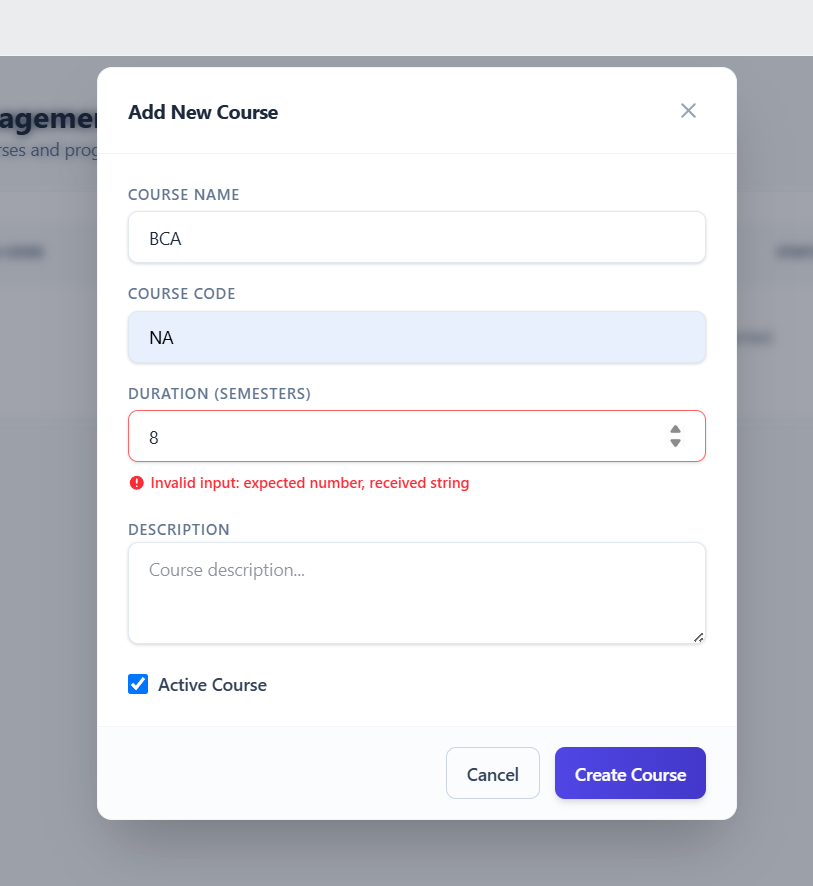

# Copilot Instructions for IMS

## Build, test, and lint

### Backend
- `cd backend && python manage.py check`
- `cd backend && python manage.py test`
- Single test: `cd backend && python manage.py test accounts.tests.LoginViewTests.test_login_success` or any dotted test path

### Frontend
- `cd frontend && npm run lint`
- `cd frontend && npm run build`
- `cd frontend && npm run dev`
- `cd frontend && npm run start`

## High-level architecture

- The repo is split into a Django REST API in `backend/` and a Next.js dashboard in `frontend/`; product docs live in `Documents/` and engineering docs in `docs/`.
- Django apps are organized by domain (`accounts`, `students`, `attendance`, `fees`, `reports`, etc.), and each app usually follows the same `models.py` / `serializers.py` / `views.py` / `urls.py` / `tests.py` pattern.
- The backend uses a custom `accounts.User` model with email login, UUID primary keys, JWT auth, a custom JSON renderer, and global DRF pagination/filtering.
- The frontend uses the App Router with route groups like `app/(auth)` and `app/(dashboard)`, and `middleware.ts` enforces role-based access for admin/teacher/student routes.
- `frontend/services/api.ts` owns the shared Axios client and token refresh flow; feature services call that client, Zod schemas live in `frontend/schemas/`, and Zustand auth state lives in `frontend/store/auth-store.ts`.

## Key conventions

- Keep API routes under `/api/`; auth endpoints stay under `/api/auth/`.
- Preserve the backend response envelope (`success`, `message`, `data` or `errors`) expected by the frontend.
- Use `select_related()` and `prefetch_related()` for list/detail endpoints that traverse relations, and prefer database aggregates for totals.
- Keep frontend auth state, localStorage, and cookies in sync; the middleware depends on the access-token cookie and `ims_user_role`.
- Shared UI belongs in `frontend/components/ui/`; page-specific state should stay close to the page or route group.
- This is a newer Next.js release than many training examples assume, so follow the guidance in `frontend/AGENTS.md` and check the docs under `node_modules/next/dist/docs/` before changing app-router or middleware behavior.
